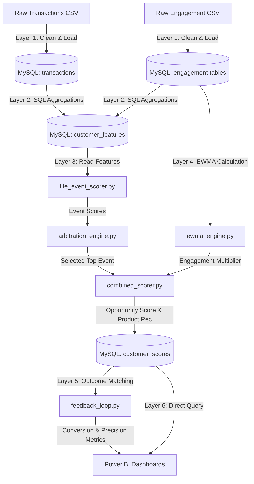

# ARCHITECTURE.md — System Design

## 1. High-Level Architecture

The **FinSight** platform is designed as an end-to-end, batch-oriented data and analytics pipeline. The architecture is structured in logical layers to separate the responsibilities of data simulation, cleaning, aggregations, behavioral scoring, engagement calculation, and visual intelligence.

```
       [ Raw Logs / CSV Data Sources ]
                     │
                     ▼
         ┌───────────────────────┐
         │ Layer 1: Ingestion &  │  <-- pipeline/clean_transform.py
         │   Anomaly Handling    │
         └───────────┬───────────┘
                     │  (Load Cleaned Data)
                     ▼
         ┌───────────────────────┐
         │ Layer 2: MySQL        │  <-- database/schema.sql
         │  Analytics Engine     │      database/queries/
         └───────────┬───────────┘
                     │  (Aggregated SQL Features)
                     ▼
         ┌───────────────────────┐
         │ Layer 3: Python       │  <-- scoring/life_event_scorer.py
         │    Scoring Engine     │      scoring/arbitration_engine.py
         └───────────┬───────────┘
                     │
                     ├──────────────────────────────┐
                     ▼                              ▼
         ┌───────────────────────┐      ┌───────────────────────┐
         │ Layer 4: Engagement   │      │  Layer 5: Feedback    │ <-- pipeline/feedback.py
         │ Intelligence Engine   │      │     & A/B Loop        │
         └───────────┬───────────┘      └───────────────────────┘
                     │  (Combined Score & Recommendations)
                     ▼
         ┌───────────────────────┐
         │ Layer 6: Power BI     │  <-- visualization/
         │      Dashboards       │
         └───────────────────────┘
```

---

## Three Intelligence Engines

FinSight combines three independent analytical engines whose
outputs are fused into a single Customer Priority Index.
Each engine answers a different question:

| Engine | Question Answered | Output |
|---|---|---|
| RFM Engine | How valuable is this customer RIGHT NOW? | Segment (1 of 8) + combined score |
| Life Event Engine | What is this customer about to do? | Event score (0–100) + recommendation |
| Velocity Engine | Is this customer's behavior shifting? | Z-score + weight multiplier |

**Why three engines instead of one:**
A customer can be valuable (Champions) without approaching a
life event. A customer can be approaching a life event without
being currently valuable (Lost). A customer's spend can spike
without any clear categorical signal. Each engine catches what
the others miss. The Priority Index requires convergent evidence
across all three engines to surface a customer as an immediate action priority.

---

## 2. Major Components

The system consists of six primary components:

* **Ingestion Pipeline (`pipeline/`):** Responsible for parsing raw transaction and engagement CSV files, identifying anomalies (e.g., negative spend, future dates, invalid categories), mapping types, and loading sanitized data into the relational database.
* **SQL Analytics Engine (`database/`):** Computes complex features over rolling time windows. It uses window functions and common table expressions (CTEs) in MySQL to perform high-performance, cohort-based grouping and frequency aggregations.
* **Life Event Scorer (`scoring/`):** A rule-based Python application that reads pre-aggregated features from the database, applies weighted rules for each of the 5 life events, and produces a score between 0 and 100.
* **Arbitration Engine (`scoring/`):** Handles conflict resolution when a customer exceeds scoring thresholds for multiple life events. It applies a multi-step priority algorithm to select a single, high-conviction event and recommendation.
* **Engagement Engine (`engagement/`):** Calculates recency-weighted multi-channel interaction metrics using Exponentially Weighted Moving Averages (EWMA) and applies a channel diversity multiplier to generate a fused Opportunity Score.
* **Feedback Loop (`pipeline/`):** Conducts back-testing and A/B test simulation. It measures target precision, recall, and revenue conversion rates against simulated customer outcome data.

---

## 3. Data Flow



### Step-by-Step Data Flow
1. **Extraction:** Python scripts parse generated CSV data and filter out transactional anomalies.
2. **Staging:** Sanitized transactions and engagement logs are loaded into MySQL `transactions` and engagement tables (`offer_views`, `email_opens`, etc.).
3. **Aggregation:** SQL scripts execute rolling 90-day queries to calculate category spend, growth rates, and cohort metrics, updating the `customer_features` table.
4. **Scoring:** The Python scoring engine loads these features, computes individual event scores, and resolves conflicts using the arbitration engine.
5. **Engagement Fusion:** The EWMA engine reads recency-weighted engagement, applies the channel diversity multiplier, and multiplies this by the primary life event score to produce the final `opportunity_score`.
6. **Writing Outputs:** The final record (scores, primary event, recommendation, and arbitration rationale) is written to `customer_scores`.
7. **Loop Validation:** The feedback script matches historical scores against subsequent purchases to evaluate conversion performance, writing results to `offer_conversions`.

---

## 4. Service Boundaries

To prevent tight coupling, the platform maintains clear service and data boundaries:

* **File Storage boundary:** The raw ingestion files, logs, and simulated CSVs are isolated in a `/data` directory. The codebase does not read directly from raw files once loaded into MySQL.
* **SQL Aggregation boundary (`customer_features`):** The Python scoring engine is completely decoupled from raw database transactions. It only interacts with the pre-aggregated `customer_features` table. This allows the database schema or the aggregation logic to change without affecting the python scoring rules.
* **Arbitration boundary (`arbitration_engine.py`):** The logic to resolve scoring conflicts is isolated from individual event scoring functions. Scoring functions calculate raw probabilities; arbitration decides which event wins based on business rules.
* **Visualization boundary (`Power BI`):** The dashboards query the final output tables (`customer_scores`, `offer_conversions`) directly. No business logic or scoring algorithms are written in Power BI (via DAX) except visual aggregations and KPI layouts.

---

## 5. External Integrations

FinSight is designed to integrate with the following external systems:

* **MySQL Database:** Serves as the primary data store, analytics computation hub, and query interface. Python scripts use `mysql-connector-python` or `SQLAlchemy` for connection pooling.
* **Power BI Desktop / Service:** Connects to the MySQL server using native database connectors to feed interactive dashboards.
* **Mock Campaign Execution (Simulated):** In a production production environment, `customer_scores` would be exported to an enterprise campaign manager (like Salesforce Marketing Cloud or Adobe Campaign). The database schema provides clean tables designed to integrate with such downstream targets.

---

## 6. Scalability Considerations

For enterprise workloads handling millions of customers and transactions, the following scalability designs are specified:

* **Database Indexing:**
  - `transactions` queries rely heavily on composite indexes: `(customer_id, txn_date)` and `(customer_id, merchant_category)`. This ensures that rolling 90-day window aggregations run in sub-millisecond execution times per customer.
  - `customer_features` and `customer_scores` are indexed on `customer_id` and `score_date` to support fast incremental loads and dashboard filtering.
* **Data Partitioning:**
  - The `transactions` table should be range-partitioned by `txn_date` (e.g., monthly partitions). This allows rapid archiving of transactions older than 12 months and improves query pruning during rolling aggregations.
* **Incremental Batch Processing:**
  - The Python scoring engine does not load the entire database into memory. It uses database cursors to fetch features in batches (e.g., 5,000 customers at a time) and processes them generator-style, maintaining a low memory footprint.
* **Aggregation Offloading:**
  - Rolling aggregations are executed entirely on the MySQL server to leverage optimized SQL indexing and execution planners, rather than pulling millions of rows into Python Pandas memory.
