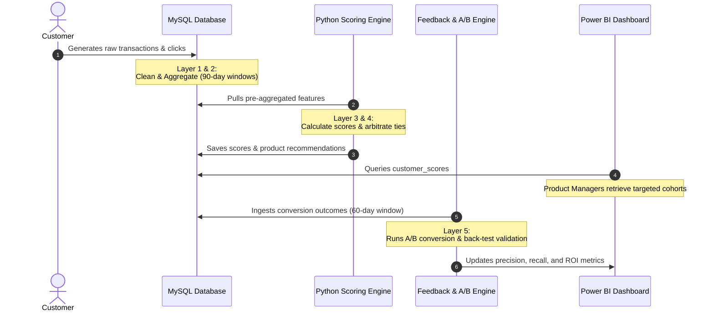

# PROJECT.md — LifeEventRadar 🎯

## Project Vision & Mission

**LifeEventRadar** is a behavioral signal detection and offer intelligence platform built to mirror the analytical thinking of American Express's Risk Product & Data Strategy teams. 

The platform’s mission is to answer a critical business question:
> **"What card product or offer should AmEx show this customer — 90 days before their life changes?"**

By capturing leading transaction indicators (e.g., buying furniture, paying university fees) and combining them with multi-channel digital engagement logs, LifeEventRadar identifies customers on the verge of major life events. It scores their behavioral intent, arbitrates between competing events, and outputs personalized, high-conviction product recommendations. This proactive approach unlocks an estimated **₹6.4 Crore** in annual spend opportunity.

---

## Problem Being Solved

Traditional marketing models target customers based on historical spend or static demographic profiles. This results in lagging or irrelevant offers. For example, offering a travel card *after* a customer has already relocated, or a student card *after* they have graduated.

**LifeEventRadar solves this by:**
1. **Detecting Leading Indicators:** Focusing on transactional signals that occur *before* a life event (e.g., test prep spending 6 months before university admission, or furniture purchases before a home move).
2. **Merging Intent with Engagement:** Scoring not just transaction spend, but also whether the customer is actively engaging with related digital communications (emails, app clicks).
3. **Providing Actionable Product Pushes:** Generating a single, high-conviction product recommendation (such as the AmEx Platinum Card for a Home Purchase, or the AmEx Travel Card for relocation) rather than bombarding them with multiple generic offers.

---

## Target Users

The platform serves three primary stakeholder groups, each accessing the data via customized Power BI dashboards:

1. **C-Suite & Risk Leaders (Executive Audience)**
   - *Core Need:* Understand high-level portfolio trends, revenue impact, and ROI of targeted campaigns.
   - *Key Question:* "What is the total revenue opportunity and where is it?"

2. **Risk & Data Scientists (Analysts)**
   - *Core Need:* Deep-dive into scoring validation, investigate false positives/negatives, and inspect the specific "evidence trail" for any given customer score.
   - *Key Question:* "Why did customer #4182 score 78 for Home Purchase?"

3. **Product & Campaign Managers (Product Team)**
   - *Core Need:* Identify target lists, select channels (email, SMS, app), and deploy campaigns with high conversion probability.
   - *Key Question:* "Which card offer should we push to which customers today?"

---

## Core Features

LifeEventRadar is built as an end-to-end analytics pipeline consisting of six distinct layers:

1. **Data Ingestion & Anomaly Handling:** Cleans, standardizes, and validates messy raw transaction and engagement logs. It handles duplicates, future-dated events, negative spend, and type mismatches.
2. **SQL Analytics Engine:** Computes rolling 90-day aggregations, cohort segmentation (Low/Medium/High spenders), and category frequency metrics using window functions and CTEs.
3. **Python Scoring Engine:** Evaluates customers against weighted rule sets (0–100) for five major life events: Home Purchase, Relocation, Marriage, New Child, and Higher Education.
4. **Engagement Intelligence Engine:** Processes digital interactions using an Exponentially Weighted Moving Average (EWMA) to bias towards recent activity, combined with a channel diversity multiplier.
5. **Outcome Feedback Loop:** Performs automated back-testing and A/B test simulations to track precision, recall, and conversion uplifts against simulated outcomes.
6. **Power BI Visualizations:** Renders the analytical outputs into three distinct, interactive dashboards.

---

## Non-Goals

To maintain focus and adhere to enterprise regulatory boundaries, the following are explicit non-goals:

* **Black-Box Machine Learning:** The scoring engine is deliberately rule-based, not ML-based (e.g., XGBoost, Neural Networks). Financial regulations require auditable and explainable logic.
* **Real-time API Scoring:** The system is designed for batch/micro-batch processing (e.g., daily/weekly score updates), not sub-second API lookups during transaction authorization.
* **PII Data Storage:** No Personally Identifiable Information (PII) is processed. The database uses system-generated `customer_id`s, age, city, and anonymized transactions.
* **Consumer-Facing Application:** This is an internal decisioning platform. It does not include a user-facing client interface or mobile application.

---

## User Workflows

### Detailed Customer Lifecycle
1. **Signal Generation:** A customer starts house hunting, visiting real estate portals and browsing appliance stores. They charge these to their AmEx card.
2. **Feature Aggregation:** Overnight, the database aggregates their 90-day spend in these categories and flags a rolling increase.
3. **Scoring & Arbitration:** The Python scoring engine calculates a Home Purchase score of 72. It also notes a Relocation score of 60. The arbitration engine applies priority rules and selects Home Purchase as the primary event.
4. **Engagement Fusion:** The engine checks email click-through logs. The customer clicked a "Home & Style" newsletter link 3 days ago (EWMA score 1.8) across two channels (email and app). This multiplies the base score, yielding a high-conviction opportunity score.
5. **Targeted Campaign:** The customer is added to the campaign list for the AmEx Platinum Card with a concierge moving offer.
6. **Conversion Tracking:** Within 45 days, the customer accepts the offer. The feedback loop records a True Positive, updating the model's precision metric.

---

## Future Roadmap

The long-term roadmap for LifeEventRadar includes:

* **Real-time Event Ingestion:** Transitioning Layer 1 from batch SQL files to streaming event topics (e.g., Apache Kafka) to detect and score signals within hours of transaction authorization.
* **Opt-Out Preference Portal:** Building a mock customer portal that interfaces with the `opt_out_registry` to simulate customer-driven data privacy controls.
* **Automated Weight Tuning:** Implementing a genetic algorithm or grid-search script in the Feedback Loop that auto-recalibrates rules and weights based on historical conversion rates.
